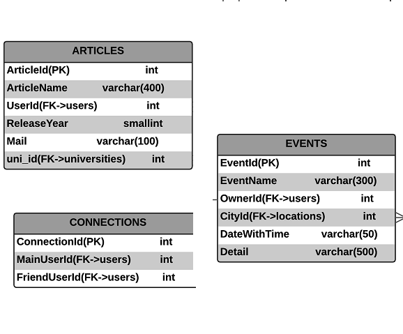

Hasan Hüseyin ÇAĞLAR Tarafından Yapılan Bölümler
=======================

Raporun bu bölümünde İşteSen adlı sosyal medya sitesinin Makaleler, Bağlantılar ve Etkinlikler sayfalarının (varlıklarının) yazılım geliştirmesi ve detayları hakkında bilgi edinebilirsiniz

Veritabanı Tablolarını Hazırlama Metodu
----------------------------------

İlgili tabloları oluşturmak ve ilk kayıtları eklemek için, **init.py** dosyasının **class INIT:** isimli sınıfı ve ona bağı olan **def ArticleEventConnection(self):** adlı metodu içerisinde işlemler gerçekleştirilmiştir, **init.py** dosyasının içerik yapısı:

.. code-block:: python

      import psycopg2 as dbapi2
      class INIT:
           #...Other methods
         def ArticleEventConnection(self):
           #... creating tables, inserting rows
           # for the articles, events and conenctions...
           
articles, connections ve events tablolarının hepsi bu tanım metodu içinde oluşturulmuştur.

    
    Tablo Diyagramları

Makaleler
--------------
Makaleler tablosu articles adıyla oluşturuldu. articles ikisi üniversities ve users tablosunu referans veren sütun, biri birincil anahtar olmak üzere toplamda 6 sütundan oluşur. Makaleler bir üniversiteye bağlı mail adresi olan bir kullanıcının beli bir yılda belli bir isimde çıkardığı makaleleri tutar.

.. code-block:: python

            query = """CREATE TABLE articles (
                    ArticleId SERIAL PRIMARY KEY,
                    ArticleName VARCHAR(400) UNIQUE NOT NULL,
                    UserId INTEGER NOT NULL REFERENCES users(UserId),
                    ReleaseYear SMALLINT NOT NULL,
                    Mail VARCHAR(100) NOT NULL,
                    uni_id INTEGER NOT NULL REFERENCES universities(id)
                    )"""
            cursor.execute(query)
            
İlk kayıtlar ekrandaki işlemleri kolaylaştırması amacıyla articles tablosuna eklendi.

.. code-block:: python

            query = """INSERT INTO articles(ArticleName, UserId,ReleaseYear, Mail, uni_id) VALUES
              ('Efficient algorithms for the (weighted) minimum circle problem',5,1982,'Hearn@ise.ufl.edu',5),
              ('3-D Mesh Geometry Compression with Set Partitioning in the Spectral Domain',6,2011,'ulugbayazit@itu.edu.tr',15),
              ('The minimum covering sphere problem',5,1972,'Hearn@ise.ufl.edu',5),
              ('Otonom araçların geleceği',7,2015,'gulerfa@itu.edu.tr',3);
              """
            cursor.execute(query)

articles.py dosyasında arayüzde yapılacak işlemler için gerekli sorgu metodları yazıldı; seçim, çokluseçim, ekleme, silme, referans verilen üniversite ve kullanıcı tablolarının listelerini çekmek vs. için.

.. code-block:: python

      def get_articlelist(self):
        with dbapi2.connect(self.cp) as connection:
            cursor = connection.cursor()
            query = """SELECT articles.ArticleId, articles.ArticleName,
             articles.UserId, users.FirstName AS Name, users.LastName AS SurName,
             articles.ReleaseYear, articles.Mail, universities.title 
             FROM articles LEFT JOIN universities ON articles.uni_id = universities.id
             LEFT JOIN users ON users.UserId=articles.UserId ORDER BY articles.ArticleName ASC """
            cursor.execute(query)
            rows = cursor.fetchall()
            return rows
        
    def get_universitylist(self):
        with dbapi2.connect(self.cp) as connection:
            cursor = connection.cursor()
            query = "SELECT * FROM universities ORDER BY title ASC"
            cursor.execute(query)
            rows = cursor.fetchall()
            return rows
        
    def get_userlist(self):
        with dbapi2.connect(self.cp) as connection:
            cursor = connection.cursor()
            query = "SELECT UserId, concat(FirstName::text, LastName::text) AS name FROM users ORDER BY FirstName ASC"
            cursor.execute(query)
            rows = cursor.fetchall()
            return rows
    def delete_article(self, ArticleId):
        with dbapi2.connect(self.cp) as connection:
            cursor = connection.cursor()
            query = "DELETE FROM articles WHERE ArticleId = '%s'" % (ArticleId)
            cursor.execute(query)
            connection.commit()
            return
    def select_article(self, ArticleId):
        with dbapi2.connect(self.cp) as connection:
            cursor = connection.cursor()
            query = """SELECT articles.ArticleId, articles.ArticleName, articles.UserId,
             users.FirstName AS Name, users.lastName AS SurName, articles.ReleaseYear, articles.Mail, articles.uni_id  
             FROM articles
             LEFT JOIN users ON users.UserId=articles.UserId
             WHERE ArticleId = '%s' ORDER BY ArticleId ASC""" % (ArticleId)
            cursor.execute(query)
            rows=cursor.fetchall()
            return rows
    def add_article(self, ArticleName, UserId,ReleaseYear, Mail,uni_id):
        with dbapi2.connect(self.cp) as connection:
            cursor = connection.cursor()
            query =  """INSERT INTO articles (ArticleName, UserId, ReleaseYear,
             Mail, uni_id) VALUES ('%s','%s','%s','%s','%s')""" % (ArticleName, UserId,ReleaseYear, Mail, uni_id)
            cursor.execute(query)
            connection.commit()
            return

    def update_article(self, ArticleId, ArticleName, UserId, ReleaseYear, Mail,uni_id):
        with dbapi2.connect(self.cp) as connection:
            cursor = connection.cursor()
            query =  """UPDATE articles SET ArticleName = '%s', UserId='%s',
            ReleaseYear='%s', Mail='%s', uni_id='%s' WHERE ArticleId='%s'""" % (ArticleName, UserId,ReleaseYear, Mail, uni_id, ArticleId)
            cursor.execute(query)
            connection.commit()
            return

Bağlantılar
--------------
Bağlantılar tablosu connections adıyla oluşturuldu. connections ikisi users tablosunu referans veren sütun, biri birincil anahtar olmak üzere toplamda 3 sütundan oluşur. Bağlantılar tablosu bir kullanıcıyla o kullanıcının kendisine arkadaş olarak bağlantı kurduğu kişileri tutar.

.. code-block:: python

            query = """CREATE TABLE connections (
                    ConnectionId SERIAL PRIMARY KEY,
                    MainUserId INT NOT NULL REFERENCES users(UserId),
                    FriendUserId INT NOT NULL REFERENCES users(UserId)
                    )"""
            cursor.execute(query)

İlk kayıtlar ekrandaki işlemleri kolaylaştırması amacıyla connections tablosuna eklendi.

.. code-block:: python

            query = """INSERT INTO connections(MainUserId, FriendUserId) VALUES
              (1,2),
              (1,3),
              (2,3),
              (4,5),
              (4,2),
              (2,5),
              (6,7),
              (3,5);
              """
            cursor.execute(query)
            
myconnections.py dosyasında arayüzde yapılacak işlemler için gerekli sorgu metodları yazıldı; seçim, çokluseçim, üniversitenin bağlantıları, kullanıcının bağlantılarıi, ekleme, silme, referans verilen tablolarının listelerini çekmek vs. için.

.. code-block:: python

    def get_connectionlist(self):
        with dbapi2.connect(self.cp) as connection:
            cursor = connection.cursor()
            query = """SELECT connections.ConnectionId, u1.FirstName AS Mfname, u1.LastName AS Mlname,
             u2.FirstName AS Ffname, u2.LastName AS Flname 
             FROM connections 
             LEFT JOIN users u1 ON connections.MainUserId = u1.UserId 
             LEFT JOIN users u2 ON connections.FriendUserId = u2.UserId"""
            cursor.execute(query)
            rows = cursor.fetchall()
            return rows
        
    def get_connectionlistbyuser(self,byUserId):
        with dbapi2.connect(self.cp) as connection:
            cursor = connection.cursor()
            query = """SELECT connections.ConnectionId, u1.FirstName AS Mfname, u1.LastName AS Mlname,
             u2.FirstName AS Ffname, u2.LastName AS Flname 
             FROM connections 
             LEFT JOIN users u1 ON connections.MainUserId = u1.UserId 
             LEFT JOIN users u2 ON connections.FriendUserId = u2.UserId
             WHERE connections.MainUserId='%s'""" %(byUserId)
            cursor.execute(query)
            rows = cursor.fetchall()
            return rows
        
    def get_connectionlistbyuniversity(self,byUniversityId):
        with dbapi2.connect(self.cp) as connection:
            cursor = connection.cursor()
            query = """SELECT  users.uni, users.FirstName, users.LastName
             FROM users 
             LEFT JOIN universities ON universities.title = users.uni 
             WHERE universities.id='%s'""" %(byUniversityId)
            cursor.execute(query)
            rows = cursor.fetchall()
            return rows
        
    def get_universityconnectionlist(self):
        with dbapi2.connect(self.cp) as connection:
            cursor = connection.cursor()
            query = """SELECT  users.uni, users.FirstName, users.LastName
             FROM users """ 
            cursor.execute(query)
            rows = cursor.fetchall()
            return rows
    def get_userlist(self):
        with dbapi2.connect(self.cp) as connection:
            cursor = connection.cursor()
            query = "SELECT UserId, concat(FirstName::text, LastName::text) AS name FROM users ORDER BY FirstName ASC"
            cursor.execute(query)
            rows = cursor.fetchall()
            return rows
        
    def get_universitylist(self):
        with dbapi2.connect(self.cp) as connection:
            cursor = connection.cursor()
            query = "SELECT * FROM universities ORDER BY title ASC"
            cursor.execute(query)
            rows = cursor.fetchall()
            return rows
        
    def delete_connection(self, ConnectionId):
        with dbapi2.connect(self.cp) as connection:
            cursor = connection.cursor()
            query = "DELETE FROM connections WHERE ConnectionId = '%s'" % (ConnectionId)
            cursor.execute(query)
            connection.commit()
            return
    def add_connection(self, MainUserId, FriendUserId):
        with dbapi2.connect(self.cp) as connection:
            cursor = connection.cursor()
            query =  "INSERT INTO connections (MainUserId, FriendUserId) VALUES ('%s','%s')" % (MainUserId, FriendUserId)
            cursor.execute(query)
            connection.commit()
            return

Etkinlikler
--------------
Etkinlikler tablosu connections adıyla oluşturuldu. connections ikisi locations ve  users tablolarını referans veren sütunlar, biri birincil anahtar olmak üzere toplamda 6 sütundan oluşur. Etkinlikler tablosu bir kullanıcının bir yerde belli bir tarihte belli bir isimle ve belli detaylarla oluşturduğu etkinlik verilerini tutar.

.. code-block:: python

            query = """CREATE TABLE events (
                    EventId SERIAL PRIMARY KEY,
                    EventName VARCHAR(300) UNIQUE NOT NULL,
                    OwnerId INTEGER NOT NULL REFERENCES users(UserId),
                    CityId INTEGER NOT NULL REFERENCES locations(loc_id),
                    DateWithTime VARCHAR(50) NOT NULL,
                    Detail VARCHAR(500) NOT NULL
                    )"""
            cursor.execute(query)

İlk kayıtlar ekrandaki işlemleri kolaylaştırması amacıyla events tablosuna eklendi.

.. code-block:: python

            query = """INSERT INTO events(EventName, OwnerId, CityId, DateWithTime, Detail) VALUES
              ('İTÜ Arı-Çekirdek Proje Yarışması',4,34,'20.12.2016, 13:30','2016 yılı proje yarışması sonuçları, İTÜ Ayazağa'),
              ('Medikal alanda Görüntü İşleme Konferansı',2,34,'01.01.2017, 16:00','Bilgisayarla görüntü işlemenin sağlık alanında uygulamaları, Sabancı Üniversitesi Merkez Kampüsü');
              """
            cursor.execute(query)
            
myevents.py dosyasında arayüzde yapılacak işlemler için gerekli sorgu metodları yazıldı; seçim, çokluseçim, ekleme, silme, referans verilen yerler ve kullanıcı tablolarının listelerini çekmek vs. için.

.. code-block:: python

    def get_eventlist(self):
        with dbapi2.connect(self.cp) as connection:
            cursor = connection.cursor()
            query = """SELECT events.EventId, events.EventName, users.FirstName, users.LastName,
            locations.city, events.DateWithTime, events.Detail
            FROM events
            LEFT JOIN users ON events.OwnerId = users.UserId 
            LEFT JOIN locations ON events.CityId = locations.loc_id """
            cursor.execute(query)
            rows = cursor.fetchall()
            return rows
        
    def get_locationlist(self):
        with dbapi2.connect(self.cp) as connection:
            cursor = connection.cursor()
            query = "SELECT loc_id, city FROM locations"
            cursor.execute(query)
            rows = cursor.fetchall()
            return rows
    def get_userlist(self):
        with dbapi2.connect(self.cp) as connection:
            cursor = connection.cursor()
            query = "SELECT UserId, concat(FirstName::text, LastName::text) AS name FROM users ORDER BY FirstName ASC"
            cursor.execute(query)
            rows = cursor.fetchall()
            return rows
    def delete_event(self, EventId):
        with dbapi2.connect(self.cp) as connection:
            cursor = connection.cursor()
            query = "DELETE FROM events WHERE EventId = '%s'" % (EventId)
            cursor.execute(query)
            connection.commit()
            return
    def select_event(self, EventId):
        with dbapi2.connect(self.cp) as connection:
            cursor = connection.cursor()
            query = """SELECT events.EventId, events.EventName, users.FirstName, users.LastName,
             locations.city, events.DateWithTime, events.Detail 
             FROM events
             LEFT JOIN users ON events.OwnerId = users.UserId 
             LEFT JOIN locations ON events.CityId = locations.loc_id 
             WHERE EventId = '%s' ORDER BY EventId ASC
             """ % (EventId)
            cursor.execute(query)
            rows=cursor.fetchall()
            return rows
    def add_event(self, EventName, OwnerId, CityId, DateWithTime, Detail):
        with dbapi2.connect(self.cp) as connection:
            cursor = connection.cursor()
            query =  "INSERT INTO events (EventName, OwnerId, CityId, DateWithTime, Detail) VALUES ('%s','%s','%s','%s','%s')" % (EventName, OwnerId, CityId, DateWithTime, Detail)
            cursor.execute(query)
            connection.commit()
            return

    def update_event(self, EventId, EventName, OwnerId, CityId, DateWithTime, Detail):
        with dbapi2.connect(self.cp) as connection:
            cursor = connection.cursor()
            query =  "UPDATE events SET EventName = '%s', OwnerId='%s', CityId='%s', DateWithTime='%s', Detail='%s'WHERE EventId='%s'" % (EventName, OwnerId, CityId, DateWithTime, Detail,EventId)
            cursor.execute(query)
            connection.commit()
            return
