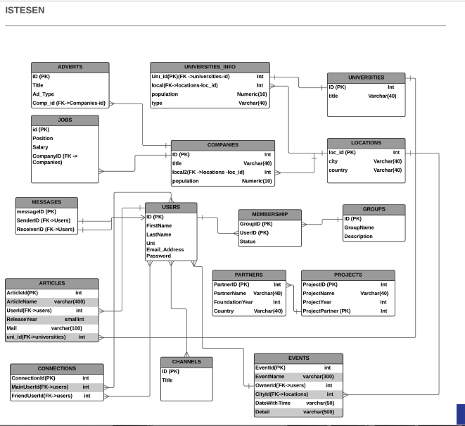

Geliştirici Kılavuzu
===============

Veri Tabanı Tasarımı
---------------

Bu proje kapsamında 15 tablo gerçeklenmiş olup, bu tablolar arasındaki ilişkiler aşağıdaki varlık-ilişki diagramı ile gösterilmiştir.

   Varlık-İlişki Diagramı

Tablolar ve birbirleriyle ilişkileri hakkında daha detaylı bilgi her tasarımcının kendi kısmında ayrıca verilecektir. 

**PK ve FK** sembolleri sırasıyla birincil ve dış anahtarları belirtir.

Code
-----

.. toctree::

   Mert Yıldız
   Hasan Hüseyin Çağlar
   Şevket Cerit
   Halit Uğurgelen
   Aydoğdu Demirci
   Mustafa Çoban
