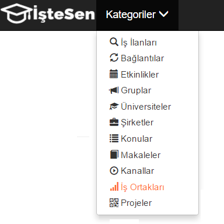
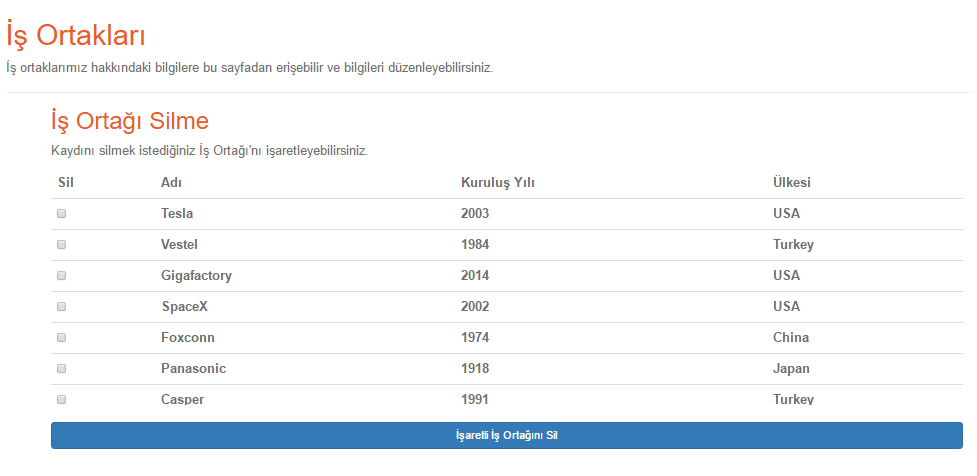
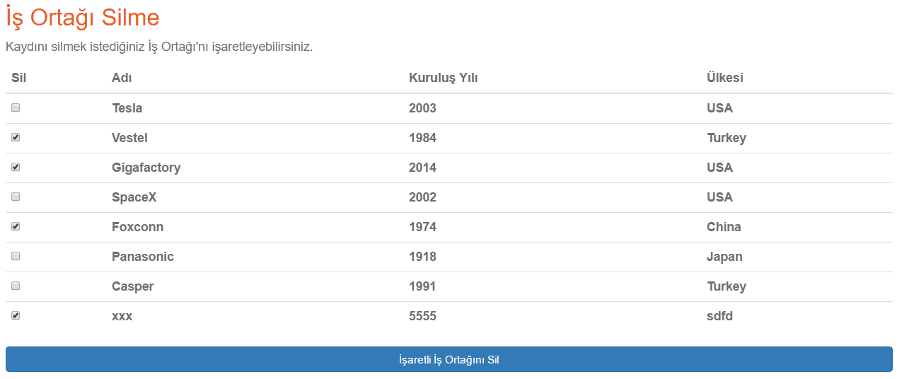
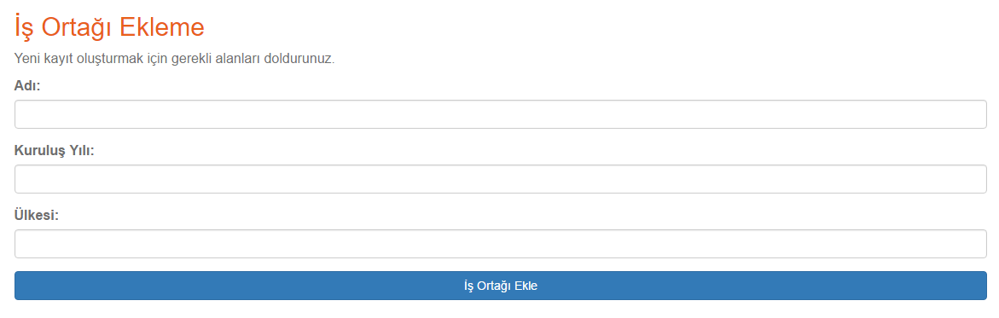
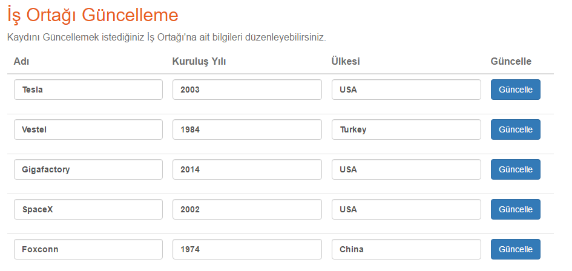
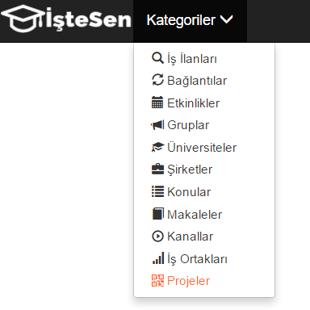
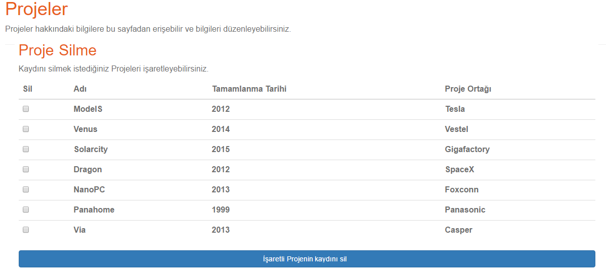
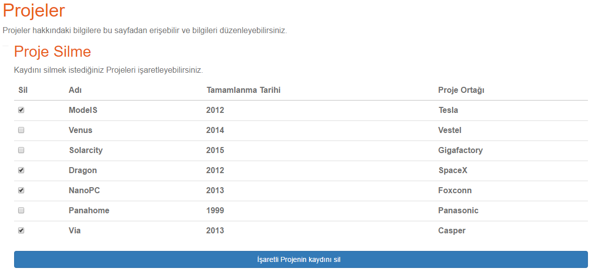
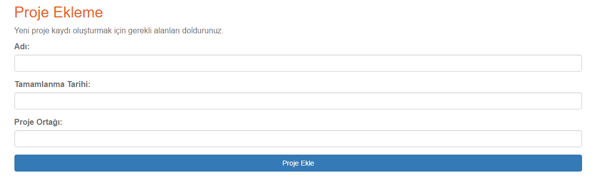
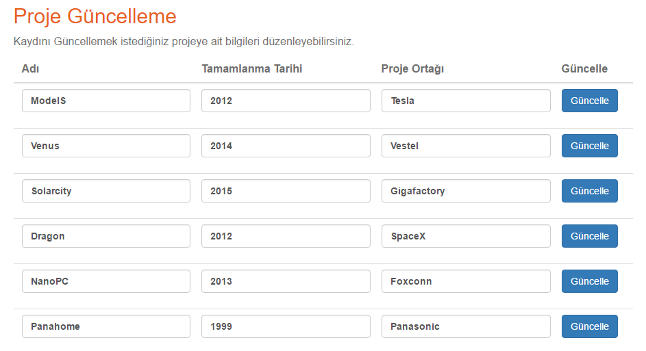

Aydoğdu Demirci Tarafından Gerçeklenen Varlıklar
================================================
İş Ortakları Düzenleme Sayfası
-------------------------------

**Nedir:** "İş Ortakları" sayfasında, işe alımlarını "İşteSen" aracılığıyla yapan şirketler görüntülenebilir ve bu şirketlere ait bilgiler düzenlenebilir. "İş Ortakları" sayfasına erişim için sitenin sol üst köşesinde yerleşik bulunan "Kategoriler" başlığı altındaki "İş Ortakları" sekmesine tıklanabilir.
 

   İş Ortakları Sayfasına Erişim

**Genel Görünüm:** "İş Ortakları" sayfası ziyaret edildiğinde ilk olarak, her bir iş ortağı ismi, kuruluş yılı ve ülkesi gibi bilgilerin yanı sıra kendisine ait bir seçim kutucuğu ile birlikte listelenmiş olarak görülür. 

   İş Ortakları Sayfası Genel Görünümü

**Silme İşlemi:** Kayıt silmek için kullanıcı önce kaydını silmek istediği iş ortağına ait seçim kutucuğuna tıklar. Sistem birden fazla kaydın aynı anda silinmesine olanak tanımaktadır. Bunun için kullanıcı bir veya birden fazla kutucuğu işaretleyebilir. Kaydının silinmesi istenen iş ortaklarına ait kutucuklar işaretlendikten sonra, üzerine **İşaretli İş Ortağını Sil** yazılı butona tıklanır ve silme işlemi gerçekleştirilir.

   İş Ortağı Kaydı Silme Ekranı

**Ekleme İşlemi:** Kayıt ekleme için kullanıcı önce kaydını eklemek istediği iş ortağına ait bilgileri kutucuklara yazar. Bilgilerin girişi tamamlandıktan sonra, üzerine **İş Ortağı Ekle**
yazılı butona tıklanarak yeni iş ortağı kaydı listeye eklenir.

   İş Ortağı Kaydı Ekleme Ekranı

İstisna
+++++++++++++++++++

* Kayıt ekleme esnasında yıl bilgisi olarak bir sayı girilmelidir. Sistem yıl bilgisi olarak yalnızca sayı girilmesine izin verir.

**Güncelleme İşlemi:** Güncelleme ekranında kayıtlı tüm iş ortaklarına bilgiler kendilerine ait form kutucuklarına yazılı ve listelenmiş olarak gelir. Kullanıcı kaydını güncellemek istediği iş ortağına ait bilgileri ilgili form kutucuğuna girerek düzenler ve kaydını düzenlediği iş ortağına ait **Güncelle** butonuna tıklar. Bu işlem sonucunda ilgili iş ortağına bilgiler güncellenmiş olur.

   İş Ortağı Kaydı Güncelleme Ekranı 

İstisna
+++++++++++++++++++

* Güncelleme esnasında yıl bilgisi olarak bir sayı girilmelidir. Sistem yıl bilgisi olarak yalnızca sayı girilmesine izin verir.

Projeler Düzenleme Sayfası
-------------------------------

**Nedir:** "Projeler" sayfasında, işe alımlarını "İşteSen" aracılığıyla yapan şirketlere ait projeler görüntülenebilir ve bu projelere ait bilgiler düzenlenebilir. "Projeler" sayfasına erişim için sitenin sol üst köşesinde yerleşik bulunan "Kategoriler" başlığı altındaki "Projeler" sekmesine tıklanabilir.
 

   Projeler Sayfasına Erişim

**Genel Görünüm:** "Projeler " sayfası ziyaret edildiğinde ilk olarak, her bir projenin ismi, tamamlandığı yıl ve projeyi gerçekleştiren şirket gibi bilgilerin yanı sıra kendisine ait bir seçim kutucuğu ile birlikte listelenmiş olarak görülür. 

   Projeler Sayfası Genel Görünümü

**Silme İşlemi:** Kayıt silmek için kullanıcı önce kaydını silmek istediği projeye ait seçim kutucuğuna tıklar. Sistem birden fazla kaydın aynı anda silinmesine olanak tanımaktadır. Bunun için kullanıcı bir veya birden fazla kutucuğu işaretleyebilir. Kaydının silinmesi istenen projelere ait kutucuklar işaretlendikten sonra, üzerine **İşaretli Projeyi Sil** yazılı butona tıklanır ve silme işlemi gerçekleştirilir.

   Proje Kaydı Silme Ekranı

**Ekleme İşlemi:** Kayıt eklemek için kullanıcı önce kaydını eklemek istediği projeye ait bilgileri kutucuklara yazar. Bilgilerin girişi tamamlandıktan sonra, üzerine **Proje Ekle**
yazılı butona tıklanarak yeni proje kaydı listeye eklenir.

   Proje Kaydı Ekleme Ekranı

İstisna
+++++++++++++++++++

* Kayıt ekleme esnasında yıl bilgisi olarak bir sayı girilmelidir. Sistem yıl bilgisi olarak yalnızca sayı girilmesine izin verir.

**Güncelleme İşlemi:** Güncelleme ekranında sisteme kayıtlı tüm projelere bilgiler kendilerine ait form kutucuklarına yazılı ve listelenmiş olarak gelir. Kullanıcı kaydını güncellemek istediği projeye ait bilgileri ilgili form kutucuğuna girerek düzenler ve kaydını düzenlediği projeye ait **Güncelle** butonuna tıklar. Bu işlem sonucunda ilgili projeye bilgiler güncellenmiş olur.

   Proje Kaydı Güncelleme Ekranı 

İstisna
+++++++++++++++++++

* Güncelleme esnasında yıl bilgisi olarak bir sayı girilmelidir. Sistem yıl bilgisi olarak yalnızca sayı girilmesine izin verir.
