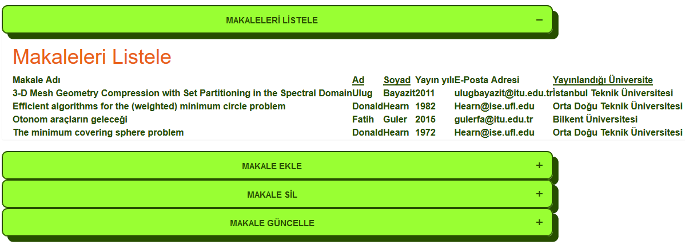
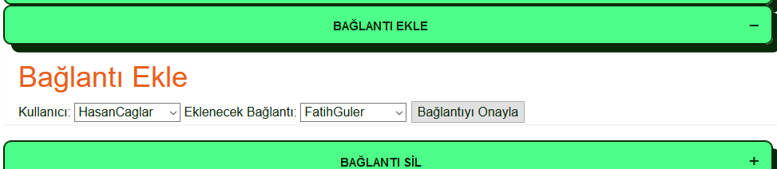
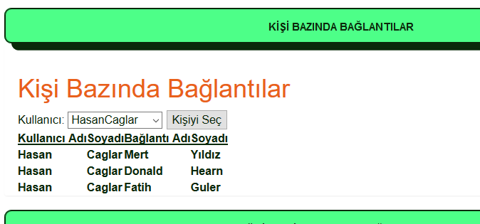

Hasan Hüseyin ÇAĞLAR (caglarh - 150110042)
============================================

Raporun bu bölümünde İşteSen adlı sosyal medya sitesinin Makaleler, Bağlantılar ve Etkinlikler sayfalarının(varlıklarının) ekran
görüntülerini ve bilgilerini inceleyebilirsiniz. Bu sayfalara erişim için tüm sayfalarda görülebilen kategoriler sekmesine
tıkladıktan sonra Makaleler, Bağlantılar veya Etkinlikler seçeneklerine tıklayarak erişebilirler.

    
*Kategorilerden istenilen sayfalara erişim*
   
MAKALELER
-----------
Makaleler sayfası kullanıcıların çoğunlukla akademik kariyerlerinde önemli yer tutan makale yayınlarının bilgileri tutulması
amacıyla geliştirilmiştir. Kullacılar yeni makale ekleyebilir, var olan makaleleri güncelleyebilir veya onları silebilir.
Kullanıcılar diledikleri zaman veritabanında var olan tüm makaleleri listeleyebilirler.

Listeleme
++++++++++++

   
*Tümm makaleler listelenir*
   
Ekleme
+++++++++

.. figure:: images/caglarh/makaleler_2.PNG
   :figclass: align-center
   
*Yeni oluşturulacak makalenin verileri girilir*

   
*Eklenen yeni makale listeleme alanında görülür*

Güncelleme
+++++++++++++

.. figure:: images/caglarh/makaleler_4.PNG
   :figclass: align-center
   
*Güncellenmek istenen makale seçilir*
   
.. figure:: images/caglarh/makaleler_5.PNG
   :figclass: align-center
   
*Yeni veriler girilir*

.. figure:: images/caglarh/makaleler_6.PNG
   :figclass: align-center
   
*Güncellenen kayıt listelenir*

Silme
+++++++

.. figure:: images/caglarh/makaleler_7.PNG
   :figclass: align-center

*Silme tekli veya çoklu olabilir*
   
.. figure:: images/caglarh/makaleler_8.PNG
   :figclass: align-center

*Silinen makaleler artık listelenemez*

   
BAĞLANTILAR
---------------

Bağlantılar sayfası kullanıcıların birbirleriyle arkadaşlık ilişkilerini  belirten ya da üniversite veya benzeri kurumsal   
yapılar üzerinden ortaklık bağı bulunan kişilerle işlemlerin gerçekleştirildiği bölümdür. Kullanıcılar kişi bazında veya
üniversite bazında filtrelemeler yaparak listemeleler yapabilir. Bir kişiye yeni bağlantı eklenebilir veya bir kişiye ait
bağlantılar tekli veya çoklu olarak silinebilir.

Kişi Bazında Listeleme
++++++++++++++++++++++++++++

.. figure:: images/caglarh/baglantilar_1.PNG
   :figclass: align-center

*Seçilen Kişiye göre gelen kayıtlar*

Üniversite Bazında Listeleme
++++++++++++++++++++++++++++++++++

   
*Seçilen üniversite altında bulunan bağlantılar*
 
Bağlantı Ekle
++++++++++++++++++++++++

*Eklemek üzere yeni bir bağlantı seçilir*
   
.. figure:: images/caglarh/baglantilar_4.PNG
   :figclass: align-center
 *Eklenen yeni bağlantı da listelenir*
   
Bağlantı Sil
++++++++++++++++++++++++

*Silinecek bağlantılar seçilir*
   
.. figure:: images/caglarh/baglantilar_6.PNG
   :figclass: align-center
*Bağlantıların son hali de listelenir*

ETKİNLİKLER
---------
Etkinlikler sayfası kullanıcılar tarafından oluşturulan ve belli bir konu hakkında belli bir mekanda düzenlemeyi planladıkları
aktiviteler için işlemlerin gerçekleştiği sayfadır. Tıpkı makalelerde olduğu gibi listeleme, ekleme, silme ve güncelleme
işlemleri yapılır.

Etkinlikler(Listeleme)
++++++++++++++++++++++++

*Tüm etkinlikler listelenir*

Etkinlik Oluştur
++++++++++++++++++++++++
.. figure:: images/caglarh/etkinlikler_8.PNG
   :figclass: align-center
*Yeni etkinliğin verileri girilir*

.. figure:: images/caglarh/etkinlikler_2.PNG
   :figclass: align-center
*Eklenen etkinlik listelenir*

Etkinliği Kaldır
++++++++++++++++++++++++
.. figure:: images/caglarh/etkinlikler_6.PNG
   :figclass: align-center
*Silinecek kayıtlar seçilir*

.. figure:: images/caglarh/etkinlikler_7.PNG
   :figclass: align-center
*Silinen veriler listeden kalkar*

Etkinliği Güncelle
++++++++++++++++++++++++

.. figure:: images/caglarh/etkinlikler_3.PNG
   :figclass: align-center
*Güncellenecek etkinlik seçilir*

.. figure:: images/caglarh/etkinlikler_4.PNG
   :figclass: align-center
*Yeni etkinlik verileri girlir*

.. figure:: images/caglarh/etkinlikler_5.PNG
   :figclass: align-center
*Güncellenen veri listelenir*
