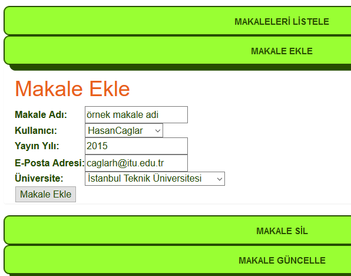

Hasan Hüseyin ÇAĞLAR Tarafından Yapılan Bölümler
================================================
Raporun bu bölümünde İşteSen adlı sosyal medya sitesinin Makaleler, Bağlantılar ve Etkinlikler sayfalarının(varlıklarının) ekran görüntülerini ve bilgilerini inceleyebilirsiniz. Bu sayfalara erişim için tüm sayfalarda görülebilen kategoriler sekmesine tıkladıktan sonra Makaleler, Bağlantılar veya Etkinlikler seçeneklerine tıklayarak erişebilirler.

.. figure:: images/caglarh/kategoriler.PNG
    :figclass: align-center
    :scale: 60 %
    
    Kategorilerden istenilen sayfalara erişim
   
   
   
MAKALELER
---------
Makaleler sayfası kullanıcıların çoğunlukla akademik kariyerlerinde önemli yer tutan makale yayınlarının bilgileri tutulması amacıyla geliştirilmiştir. Kullacılar yeni makale ekleyebilir, var olan makaleleri güncelleyebilir veya onları silebilir. Kullanıcılar diledikleri zaman veritabanında var olan tüm makaleleri listeleyebilirler.

Listeleme 
+++++++++
Makaleleri Listele alanına tıklanır. Seçim sorguları kullanılarak varlığa ait bütün mevcut kayıtlar listelenir. **(Fig. 1.24'ü inceleyiniz.)**

.. figure:: images/caglarh/makaleler_1.PNG
   :figclass: align-center
   :scale: 60 %
   
   Tüm makaleler listelenir
  
  
Ekleme
++++++
Makale Ekle alanına tıklanır. Yeni veriler girilerek Makale ekle butonuyla onaylanır, eklenen kayıt tekrar listelenip tabloya kaydedildiği görülür. **(Fig. 1.25 ve 1.26'yı inceleyiniz.)**

   
   Yeni oluşturulacak makalenin verileri girilir

.. figure:: images/caglarh/makaleler_3.PNG
   :figclass: align-center
   :scale: 60 %
   
   Eklenen yeni makale listeleme alanında görülür

Güncelleme
++++++++++
Makale Güncelle alanına tıklanır. Listeden bir kayıt 'radiobutton' ile seçilip onay butonuna basılır. İlgili kayıda ait gelen  veriler tekrardan değiştirilip Makale Güncelle butonuna basılarak onaya gönderilir. En son olarak değişen veriler listeleme alanından gözlemlenir. **(Fig. 1.27, 1.28 ve 1.29'u inceleyiniz.)**

.. figure:: images/caglarh/makaleler_4.PNG
   :figclass: align-center
   :scale: 60 %
   
   Güncellenmek istenen makale seçilir
   
.. figure:: images/caglarh/makaleler_5.PNG
   :figclass: align-center
   :scale: 60 %
   
   Yeni veriler girilir

.. figure:: images/caglarh/makaleler_6.PNG
   :figclass: align-center
   :scale: 60 %
   
   Güncellenen kayıt listelenir

Silme
+++++
Makale Sil alanına tıklanır. 'CheckBox'lar ile istenilen kayıtlar seçilir, sonra Seçili Makaleleri Sil onay butonuna basılarak silme işlemi yapılır. Listeleme ekranında artık silinen kayıtlar görülmez. **(Fig. 1.30 ve 1.31'i inceleyiniz.)**

.. figure:: images/caglarh/makaleler_7.PNG
   :figclass: align-center
   :scale: 60 %
    
   Silme tekli veya çoklu olabilir
   
.. figure:: images/caglarh/makaleler_8.PNG
   :figclass: align-center
   :scale: 60 %
   
   Silinen makaleler artık listelenemez
 
 
 
BAĞLANTILAR
-----------
Bağlantılar sayfası kullanıcıların birbirleriyle arkadaşlık ilişkilerini  belirten ya da üniversite veya benzeri kurumsal    yapılar üzerinden ortaklık bağı bulunan kişilerle işlemlerin gerçekleştirildiği bölümdür. Kullanıcılar kişi bazında veya üniversite bazında filtrelemeler yaparak listemeleler yapabilir. Bir kişiye yeni bağlantı eklenebilir veya bir kişiye ait bağlantılar tekli veya çoklu olarak silinebilir.

Kişi Bazında Listeleme
++++++++++++++++++++++
Kişi Bazında Listeleme alanına tıklanır. Kullanıcı seçimi yapılır ve Kişiyi Seç onay butonuna basılır. Seçilen kullanıcının  arkadaşları ekrana listelenir. **(Fig. 1.32'yi inceleyiniz.)**

   
   Seçilen Kişiye göre gelen kayıtlar

Üniversite Bazında Listeleme
++++++++++++++++++++++++++++
Üniversite Bazında Listeleme alanına tıklanır. Üniversite seçimi yapılır sonra Üniversiteyi Seç onay butonuna tıklanır. Seçilen üniversiteye bağlı kullanıcılar listelenir. **(Fig. 1.33'ü inceleyiniz.)**

.. figure:: images/caglarh/baglantilar_2.PNG
   :figclass: align-center
   :scale: 60 %
   
   Seçilen üniversite altında bulunan bağlantılar
 
 
Bağlantı Ekle
+++++++++++++
Bağlantı Ekle alanına tıklanır. Seçilen kullanıcıya bağlantı olarak eklenmek isteyen arkadaş kullanıcı seçilir, sonra Bağlantıyı Onayla'ta basılır. Eklenen bağlantı Kişi Bazında Listeleme alanından kontrol edilir. **(Fig. 1.34 ve 1.35'i inceleyiniz.)**

.. figure:: images/caglarh/baglantilar_3.PNG
   :figclass: align-center
   :scale: 60 %
   
   Eklemek üzere yeni bir bağlantı seçilir
   
.. figure:: images/caglarh/baglantilar_5.PNG
   :figclass: align-center
   :scale: 60 %
   
   Eklenen yeni bağlantı da listelenir
   
   
Bağlantı Sil
++++++++++++
Bağlantı Sil alanına basılır. 'CheckBox'lar ile seçilen kullanıcılar bağlantıdan çıkarılmak üzere Seçili Bağlantıları Sil Butonuna basılır. Silinen bağlantılar artık listeleme bölümünde görünmeyecektir. **(Fig. 1.36 ve 1.37'yi inceleyiniz.)**

.. figure:: images/caglarh/baglantilar_4.PNG
   :figclass: align-center
   :scale: 60 %
   
   Silinecek bağlantılar seçilir
   
.. figure:: images/caglarh/baglantilar_6.PNG
   :figclass: align-center
   :scale: 60 %
   
   Bağlantıların son hali de listelenir

ETKİNLİKLER
-----------
Etkinlikler sayfası kullanıcılar tarafından oluşturulan ve belli bir konu hakkında belli bir mekanda düzenlemeyi planladıkları aktiviteler için işlemlerin gerçekleştiği sayfadır. Tıpkı makalelerde olduğu gibi listeleme, ekleme, silme ve güncelleme işlemleri yapılır.

Etkinlikler(Listeleme)
++++++++++++++++++++++
Etkinlikler alanına tıklanır. Seçim sorguları kullanılarak varlığa ait bütün mevcut kayıtlar listelenir. **(Fig. 1.38'i inceleyiniz.)**

.. figure:: images/caglarh/etkinlikler_1.PNG
   :figclass: align-center
   :scale: 60 %
   
   Tüm etkinlikler listelenir

Etkinlik Oluştur
++++++++++++++++
Etkinlik Oluştur alanına tıklanır. Yeni veriler girilerek Etkinliği Oluştur butonuyla onaylanır, eklenen kayıt tekrar listelenip tabloya kaydedildiği görülür. **(Fig. 1.39 ve 1.40'ı inceleyiniz.)**

   
   Yeni etkinliğin verileri girilir

.. figure:: images/caglarh/etkinlikler_2.PNG
   :figclass: align-center
   :scale: 60 %
   
   Eklenen etkinlik listelenir

Etkinliği Kaldır
++++++++++++++++
Etkinliği Kaldır alanına tıklanır. 'CheckBox'lar ile istenilen kayıtlar seçilir, sonra Seçili Etkinlikleri Kaldır onay butonuna basılarak silme işlemi yapılır. Listeleme ekranında artık silinen kayıtlar görülmez. **(Fig. 1.41 ve 1.42'yi inceleyiniz.)**

.. figure:: images/caglarh/etkinlikler_6.PNG
   :figclass: align-center
   :scale: 60 %
   
   Silinecek kayıtlar seçilir

.. figure:: images/caglarh/etkinlikler_7.PNG
   :figclass: align-center
   :scale: 60 %
   
   Silinen veriler listeden kalkar

Etkinliği Güncelle
++++++++++++++++++++++++
Etkinliği Güncelle alanına tıklanır. Listeden bir kayıt 'radiobutton' ile seçilip onay butonuna basılır. İlgili kayıda ait gelen veriler tekrardan değiştirilip Etkinliği Güncelle butonuna basılarak onaya gönderilir. En son olarak değişen veriler listeleme yalanından gözlemlenir. **(Fig. 1.43, 1.44 ve 1.45'i inceleyiniz.)**

.. figure:: images/caglarh/etkinlikler_3.PNG
   :figclass: align-center
   :scale: 60 %
   
   Güncellenecek etkinlik seçilir

.. figure:: images/caglarh/etkinlikler_4.PNG
   :figclass: align-center
   :scale: 60 %
   
   Yeni etkinlik verileri girlir

.. figure:: images/caglarh/etkinlikler_5.PNG
   :figclass: align-center
   :scale: 60 %
   
   Güncellenen veri listelenir

