Mert YILDIZ Tarafından Yapılan Kısımlar
================================

Raporun bu kısımda projede Mert YILDIZ tarafından geliştirilen sayfalar ve bu sayfaların kullanımları hakkında detaylı olarak bilgilendirme yapılacaktır.

Altbilgi
----------------

   Sayfalarda Bulunan Altbilgi Kısmı

**Altbilgide bulunan öğeler** 

	* Şirket ismi ve Kuruluş Yılı: 2016 İşteSen,Inc
	* Gizlilik: Sitenin gizlilik politikasına ulaşmayı sağlayan bir link
	* İletişim : Site yöneticileri ile iletişime geçebilmek ve şirketin iletişim bilgilerini görüntülemek amacıyla oluşturulan sayfaya yönlendiren bir link
	* Yerler : Sistemde kayıtlı olarak bulunan yerleri görüntülemek ve ekleme, seçme gibi işlemlerin yapılabildiği sayfaya yönlendiren bir link
	* Back to top : Sayfanın en başına yönlendirmek için kullanılan bir link 

Üniversiteler Sayfası
---------------------

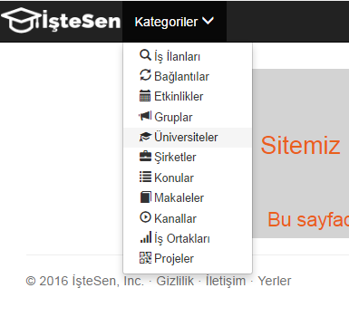
   
   Üniversiteler Sayfasına Erişim 

Sitenin "Kategoriler" bölümünden "Üniversiteler" seçeneğine tıklanarak sistemdeki üniversiteler hakkında çeşitli bilgilerin edinilebileceği ve kullanıcıların ekleme, güncelleme, silme ve seçme gibi işlemler yapabilecekleri bu sayfaya erişmeleri mümkündür.

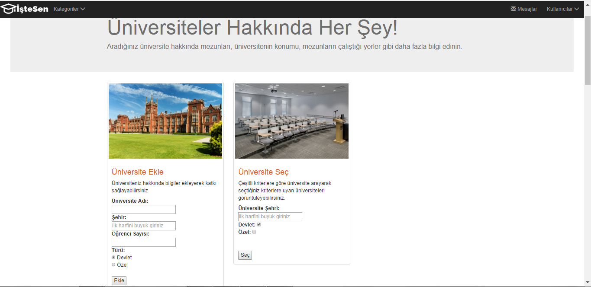

   Üniversiteler Sayfası Ekleme ve Seçme Fonksiyonları

**Ekleme İşlemi**

Sisteme yeni bir üniversite eklemek için sitede tasarlanan form içindeki "Üniversite Adı","Şehri","Öğrenci Sayısı" ve "Türü" bilgileri eksiksiz olarak girilmelidir. Bu alanlar doldurulduktan sonra **Ekle** butonuna basıldığında yeni üniversite arka planda veri tabanındaki tablolara ve sayfada da alt kısımda bulunan tablonun son satırına eklenmiş olduğundan buradan görülebilir. 

Burada yeni bilgilerin girilmesi sırasında dikkat edilmesi gereken bir husus, şehir bilgisi girilirken özellikle ilk harfinin büyük harfle başlaması gerektiğidir.

**Seçme İşlemi**

Üniversiteler içinden "Şehir" ve "Tür" kriterlerine göre seçme işlemi yapılabilir. Bunun için sayfada bulunan "Üniversite Seç" kısımdaki  "Şehir" kısmına görüntülenmek istenen şehrin ismi yazılmalı ve altındaki kontrol kutuları kullanılarak ise "Özel" yada "Devlet" tipi üniversitelerden hangilerinin seçilmek istendiği belirtilmelidir. Bu şekilde kriterler belirtildikten sonra **Seç** butonuna basılır ve istenen özelliklere sahip olan üniversiteler ayrı bir sayfada listelenmiş olarak gösterilir. Örneğin, Ankara ilindeki devlet üniversiteleri seçilmek istenirse sonuç ekranı aşağıdaki şekildeki gibi olacaktır. 

Bu kısımda da dikkat edilmesi gereken husus şehir yazılırken ilk harfinin büyük olması gerektiğidir.

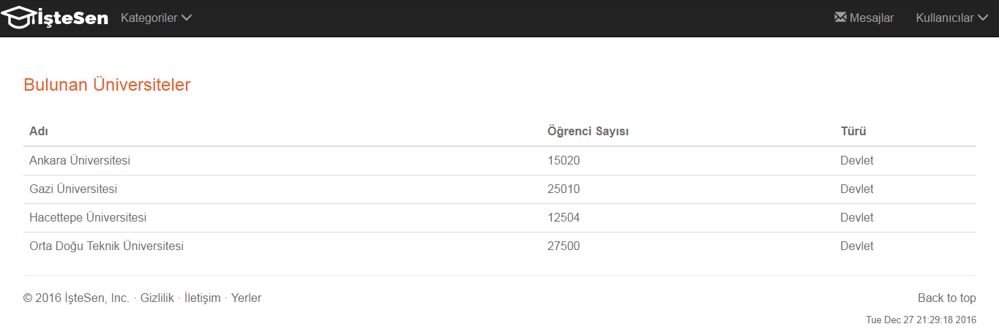

   Seçilen Üniversitelerin Gösterildiği Ekran

**Güncelleme İşlemi**

Herhangi bir üniversite güncellenmek istendiğinde sayfada yer alan üniversitelerin listelenmiş olduğu tabloda ilgili üniversitenin "Güncellensin mi?" sütunu altında bulunan "Güncelle" linkine tıklanmalıdır. 

   Üniversite Güncelleme

Bu şekilde güncellenmek istenen üniversitenin linkine tıklandıktan sonra seçilen üniversiteye ait bilgilerle dolu halde olan metin kutularının olduğu yeni bir güncelleme sayfası açılır. Burada üniversiteye ait istenen bilgiler yenileriyle istenilen şekilde değiştirildikten sonra sayfanın sonunda bulunan **Güncelle** butonu tıklanmalıdır. Bu işlemden sonra üniversiteler sayfasına geri dönülecek ve güncellenmek için seçilmiş olan üniversite yeni hali ile listenin sonunda görülebilecektir. 

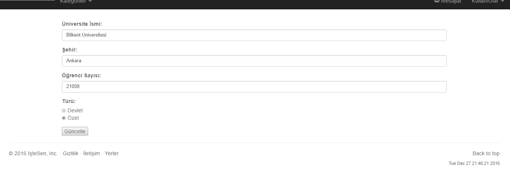

   Üniversite Güncelleme Sayfası

**Silme İşlemi**

Herhangi bir üniversite silinmek istendiğinde sayfada yer alan üniversitelerin listelenmiş olduğu tabloda ilgili üniversitenin "Silinsin mi?" sütunu altında bulunan kontrol kutusu işaretlenmelidir. 

   Üniversite Silmek için İşaretleme İşlemi

Bu şekilde silinmek istenen her üniversitenin kontrol kutusu işaretlendikten sonra sayfanın sonunda bulunan **Sil** butonu tıklanmalıdır. Bu işlemden sonra sayfa yenilenecek ve işaretlenmiş olan üniversiteler sayfadan ve arka planda veri tabanından kaldırılmış olacaklardır.

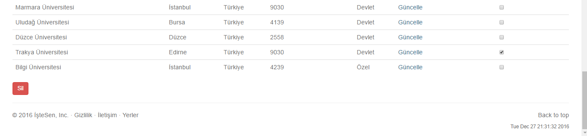

   Üniversite Silme İşlemi

   

İstisnalar
+++++++++++++++++++

* Seçme işlemi sırasında istenen özelliklere sahip üniversite yok ise boş sayfa açılır.

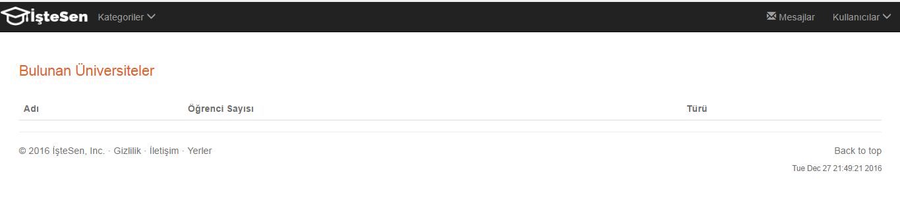

   Üniversite Boş Seçme İşlemi

* İşlemler için yanlış girdi değerleri girilirse, örneğin seçme işlemi için sistemde olmayan bir şehir girilirse, veya şehir hatalı girilirse, bu durumlar için hazırlanmış özel hata sayfası açılır.

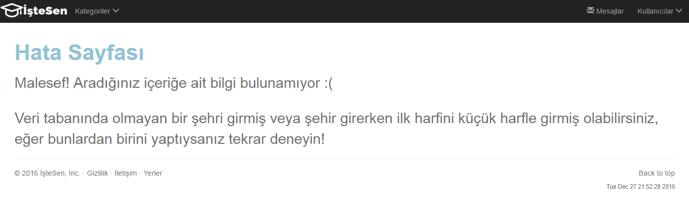

   Hata Sayfası

* Seçme işlemi için "Tür" kısmında "Devlet" ve/ya "Özel" seçeneklerinden en az biri seçilmiş olmalıdır, yoksa aynı şekilde sistem hata verir.

Şirketler Sayfası
---------------------

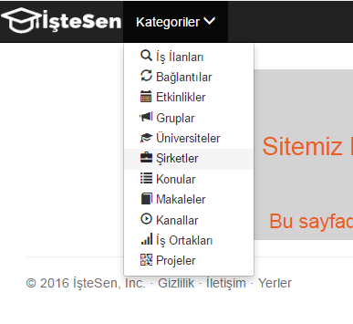

   Şirketler Sayfasına Erişim 

Sitenin "Kategoriler" bölümünden "Şirketler" seçeneğine tıklanarak sistemdeki şirketler hakkında çeşitli bilgilerin edinilebileceği ve kullanıcıların ekleme, güncelleme, silme ve seçme gibi işlemler yapabilecekleri bu sayfaya erişmeleri mümkündür.

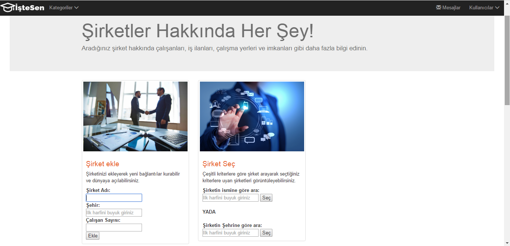

   Şirketler Sayfası Ekleme ve Seçme Fonksiyonları

**Ekleme İşlemi**

Sisteme yeni bir şirket eklemek için sitede tasarlanan form içindeki "Şirket Adı","Şehir", ve "Çalışan Sayısı" bilgileri eksiksiz olarak girilmelidir. Bu alanlar doldurulduktan sonra **Ekle** butonuna basıldığında yeni şirket arka planda veri tabanındaki tablolara ve sayfada da alt kısımda bulunan tablonun son satırına eklenmiş olduğundan buradan görülebilir. 

Burada yeni bilgilerin girilmesi sırasında dikkat edilmesi gereken husus, şehir bilgisi girilirken özellikle ilk harfinin büyük harfle başlaması gerektiğidir.

**Seçme İşlemi**

Şirketler içinden "Şehir" veya "İsim" kriterlerine göre seçme işlemi yapılabilir. İsme göre seçim yapmak için sayfada bulunan "Şirket Seç" kısımdaki  "Şirketin ismine göre ara" kısmına görüntülenmek istenen şirketin ismi yazılmalı ve yanında bulunan **Seç** butonuna basılmalıdır. Yada eğer şehir kriterine göre arama yapılmak isteniyorsa "Şirketin şehrine göre ara" kısmına görüntülenmek istenen şehir bilgisi girilmeli ve ardından **Seç** butonuna basılmalıdır. Bu şekilde kriterler belirtildikten ve **Seç** butonuna basıldıktan sonra istenen özelliklere sahip olan şirketler ayrı bir sayfada listelenmiş olarak gösterilir. Örneğin, Ankara ilindeki şirketler seçilmek istenirse sonuç ekranı aşağıdaki şekildeki gibi olacaktır. 

Bu kısımda da dikkat edilmesi gereken husus şehir yazılırken ilk harfinin büyük olması gerektiğidir.

.. figure:: images/mert/comp_secilen.png
   :figclass: align-center

   Seçilen Şirketlerin Gösterildiği Ekran

**Güncelleme İşlemi**

Herhangi bir şirket güncellenmek istendiğinde sayfada yer alan şirketlerin listelenmiş olduğu tabloda ilgili şirketin "Güncellensin mi?" sütunu altında bulunan "Güncelle" linkine tıklanmalıdır. 

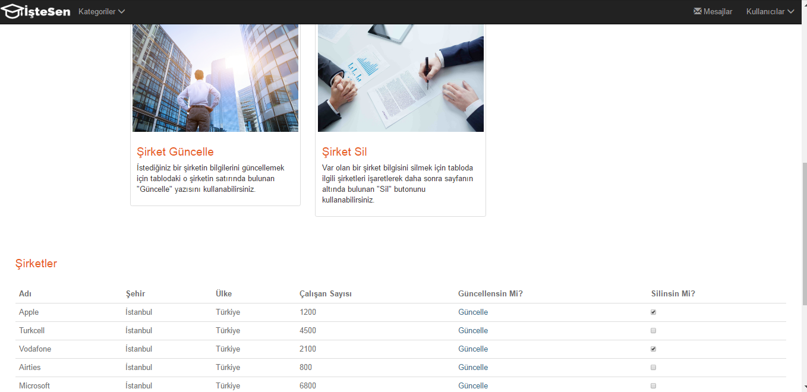

   Şirket Güncelleme

Bu şekilde güncellenmek istenen şirketin linkine tıklandıktan sonra seçilen şirkete ait bilgilerle dolu halde olan metin kutularının olduğu yeni bir güncelleme sayfası açılır. Burada şirkete ait istenen bilgiler yenileriyle istenilen şekilde değiştirildikten sonra sayfanın sonunda bulunan **Güncelle** butonu tıklanmalıdır. Bu işlemden sonra şirketler sayfasına geri dönülecek ve güncellenmek için seçilmiş olan şirket yeni hali ile listenin sonunda görülebilecektir. 

.. figure:: images/mert/comp_guncelle.png
   :figclass: align-center

   Şirket Güncelleme Sayfası

**Silme İşlemi**

Herhangi bir şirket silinmek istendiğinde sayfada yer alan şirketlerin listelenmiş olduğu tabloda ilgili şirketin "Silinsin mi?" sütunu altında bulunan kontrol kutusu işaretlenmelidir. 

   Şirket Silmek için İşaretleme İşlemi

Bu şekilde silinmek istenen her şirketin kontrol kutusu işaretlendikten sonra sayfanın sonunda bulunan **Sil** butonu tıklanmalıdır. Bu işlemden sonra sayfa yenilenecek ve işaretlenmiş olan şirketler sayfadan ve arka planda veri tabanından kaldırılmış olacaklardır.

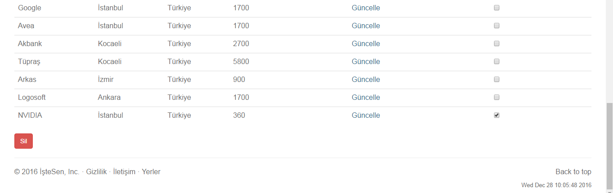

   Şirket Silme İşlemi

   

İstisnalar
+++++++++++++++++++

* Seçme işlemi sırasında istenen özelliklere sahip şirket yok ise boş sayfa açılır.

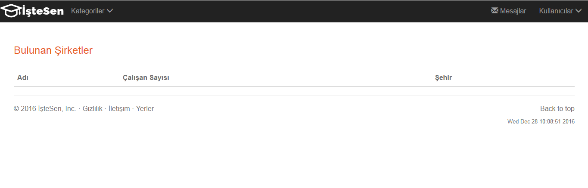

   Şirket Boş Seçme İşlemi

* İşlemler için yanlış girdi değerleri girilirse, örneğin seçme işlemi için sistemde olmayan bir şehir girilirse, veya şehir hatalı girilirse, bu durumlar için hazırlanmış özel hata sayfası açılır.

   Hata Sayfası

Yerler Sayfası
---------------------

.. figure:: images/mert/yer_logo.png
   :figclass: align-center

   Yerler Sayfasına Erişim 

Sitenin "Altbilgi" bölümünden "Yerler" linkine tıklanarak sistemdeki yerler hakkında çeşitli bilgilerin edinilebileceği ve kullanıcıların çeşitli işlemler yapabilecekleri bu sayfaya erişmeleri mümkündür. 

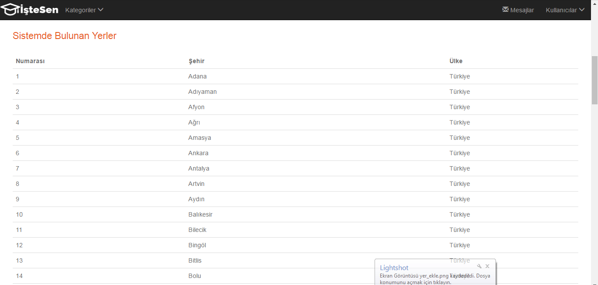

   Kayıtlı Yerler

Bu sayfada amaç sistemde kayıtlı olarak bulunan yerleri görüntüleyebilmek ve istenirse yeni yerler ekleyebilmektir. Çünkü bu bilgiler diğer sayfalarda bazı işlemleri yapabilmek için gerekli olabilmektedir. Hali hazırda Türkiye'nin tüm illeri plaka kodlarına göre sisteme eklenmiş haldedir.

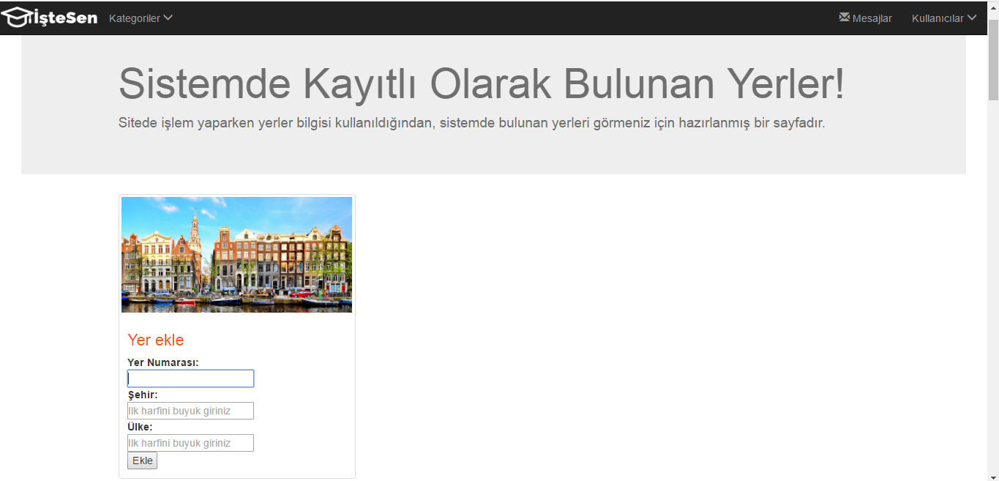

   Yerler Sayfası Ekleme Fonksiyonu

**Ekleme İşlemi**

Sisteme yeni bir yer eklemek için sitede tasarlanan form içindeki "Yer numarası","Şehir", ve "Ülke" bilgileri eksiksiz olarak girilmelidir. Bu alanlar doldurulduktan sonra **Ekle** butonuna basıldığında yeni yer arka planda veri tabanındaki tablolara ve sayfada da alt kısımda bulunan tablonun son satırına eklenmiş olduğundan buradan görülebilir. 

Burada yeni bilgilerin girilmesi sırasında dikkat edilmesi gereken husus, şehir bilgisi girilirken özellikle ilk harfinin büyük harfle başlaması gerektiğidir.

**Diğer İşlemler**

Yerler varlığı için ekleme işlemi dışında, silme, ve güncelleme işlemleri bu varlığın diğer varlıklara bağlı olması nedeniyle kısıtlanmıştır. Bu nedenle sayfada da bu fonksiyonlar için bir 
arayüz tasarlanmamıştır. 

Seçme işlemi ise zaten tablonun bağlı olduğu diğer varlıkların sayfalarında(Şirketler ve Üniversiteler gibi) yapılıyor olup, ayrıca bu sayfada da kayıtlı olan yerleri göstermek için kullanılmıştır. 

