Mustafa Çoban Tarafından Yapılan Kısımlar
=========================================

İŞ İLANLARI
-----------

**İş İlanları ile ilgili sayfalarda aşağıdaki işlemler gerçekleştirilebilmektedir:**
   * **İş İlanlarını Görüntüleme**
   * **Yeni İş İlanı Ekleme**
   * **İş İlanlarını Güncelleme**
   * **İş İlanlarını Silme**

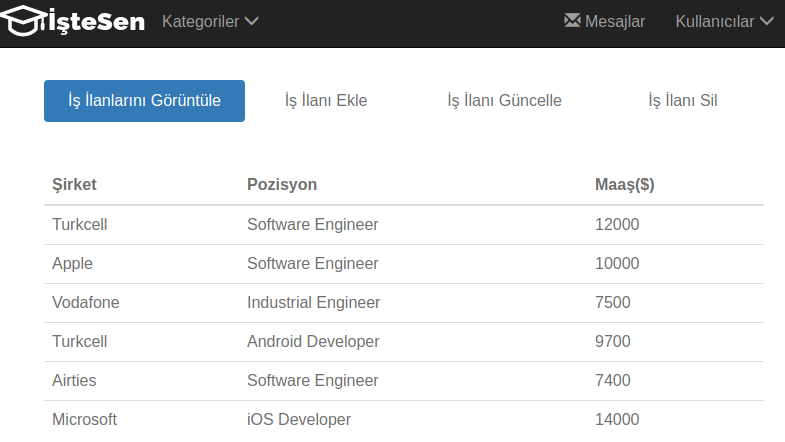

   İş İlanları Görüntüleme Sayfası

Bu sayfada kullanıcılar veritabanında tutulan bütün iş ilanlarını tablo biçiminde görüntüleyebilirler.

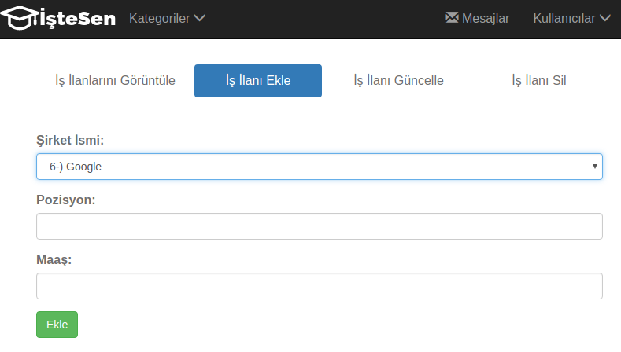

   İş İlanı Ekleme Sayfası

Bu sayfada kullanıcılar dropdown listeden iş ilanı eklemek istedikleri şirketi
seçtikten sonra pozisyon ve maaş bilgisini girerek "Ekle" butonu aracılığıyla istedikleri
iş ilanını ekleyebilirler. Ekle butonu iş ilanları görüntüleme sayfasına yönlendirerek eklenen
iş ilanının listeden kontrol edilmesini sağlamaktadır.

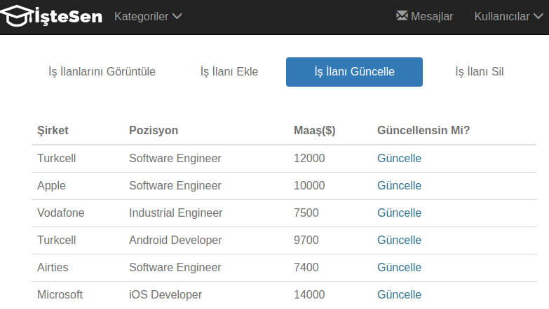

   İş İlanı Güncelleme Ana Sayfası

İş ilanı güncelleme sayfasında kullanıcıya öncelikle bütün iş ilanları tablo halinde listelenir. Kullanıcı güncellemek
istediği iş ilanının yanında bulunan *güncelle* linkine tıklayarak ilgili iş ilanının güncelleme sayfasına yönlendirilir.

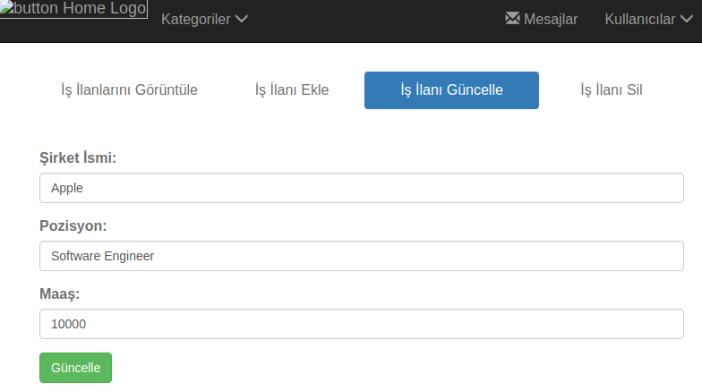

   Güncellenecek İş İlanının Güncelleme Sayfası

Bu sayfada kullanıcının seçtiği iş ilanının bilgileri önceden ilgili alanlara eklenir, bu sayede kullanıcı güncelleyeceği
iş ilanının bilgilerini görür ve güncellemek istediği bölümleri değiştirdikten sonra *Güncelle* butonuna basarak ilgili
iş ilanını günceller.

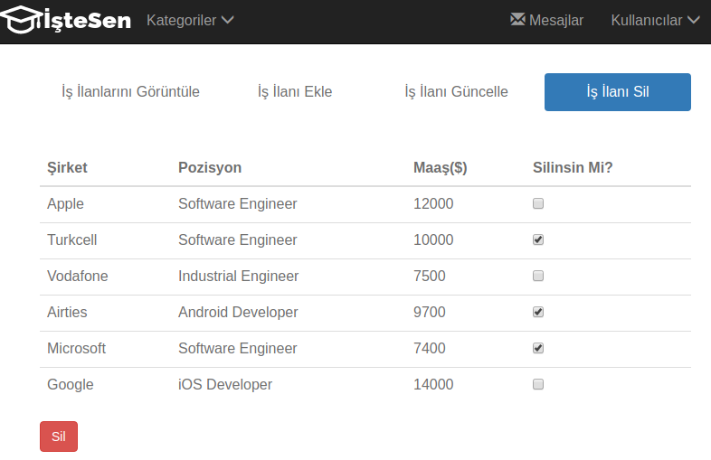

   İş İlanı Silme Sayfası

İş ilanı silme sayfasında kullanıcı bütün iş ilanlarının bulunduğu tablodan silmek istediği iş ilanlarının yanlarında bulunan
seçim kutularını işaretledikten sonra *Sil* butonuna basarak istediği iş ilanlarını silebilir.

GRUPLAR
-------

**Gruplar ile ilgili sayfalarda aşağıdaki işlemler gerçekleştirilebilmektedir:**
   * **Grupları ve Üyelerini Görüntüleme**
   * **Gruplara Üye Ekleme**
   * **Yeni Grup Oluşturma**
   * **Grupları Güncelleme**
   * **Grupları Silme**

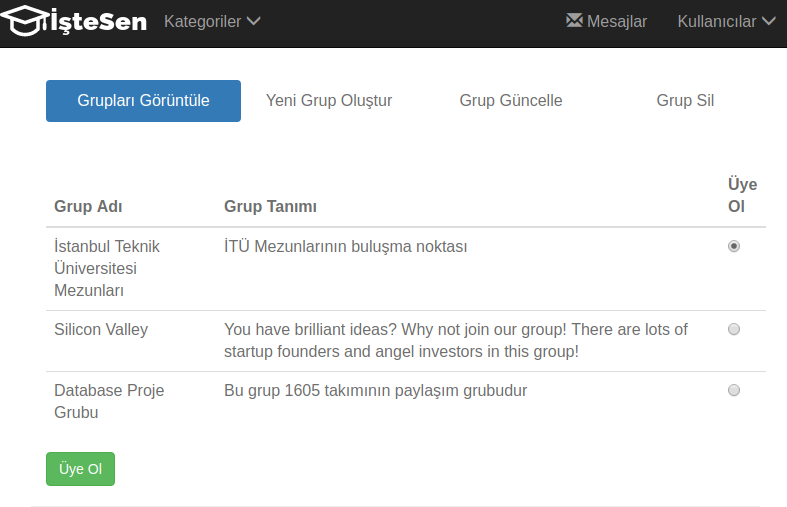

   Grup Görüntüleme Sayfası

Bu sayfada bütün gruplar tablo halinde listelenmektedir. Her grubun adı ve tanımı o grubun içeriğine yönlendiren linkler
olarak kullanılmaktadır. Her grubun yanında bulunan *Üye ol* check boxı ile kullanıcı istediği gruba üye olabilmektedir.

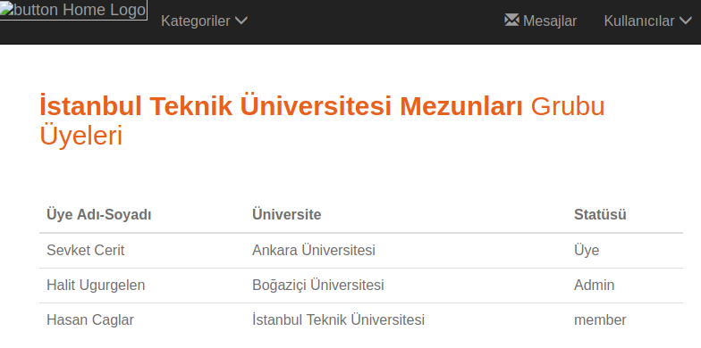

   Grup İçeriği Görüntüleme Sayfası

Grupların içeriğinde o grupta bulunan üyelerin listeleri tablolar halinde gösterilmektedir.

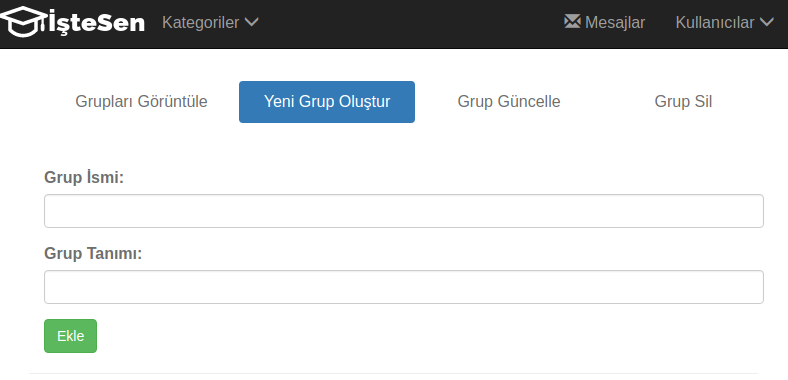

   Grup Ekleme Sayfası

Grup ekleme sayfasında grup adı ve grup tanımı bölümleri girilerek *Ekle* butonu aracılığıyla yeni gruplar oluşturulabilmektedir.

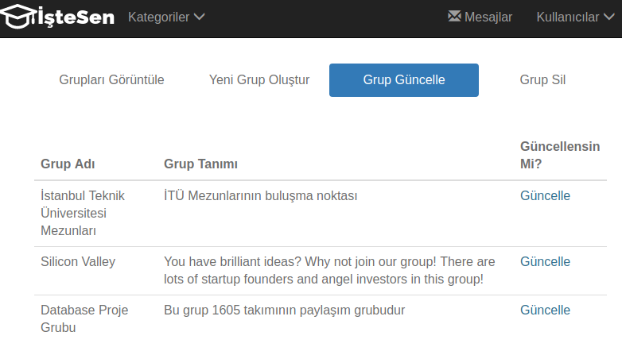

   Grup Güncelleme Sayfası

Grupları güncelleme sayfasında kullanıcıya öncelikle bütün gruplar tablo halinde listeleniyor. Kullanıcı güncellemek
istediği grubun yanında bulunan *güncelle* linkine tıklayarak ilgili grubun güncelleme sayfasına yönlendirilir.

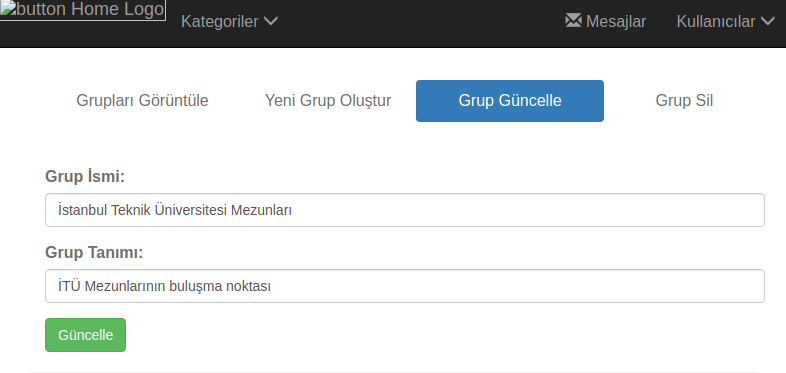

   Seçilen Grubun Güncelleme Sayfası

Bu sayfada kullanıcının seçtiği grubun bilgileri önceden ilgili alanlara eklenir, bu sayede kullanıcı güncelleyeceği
grubun bilgilerini görür ve güncellemek istediği bölümleri değiştirdikten sonra *Güncelle* butonuna basarak ilgili
grubu günceller.

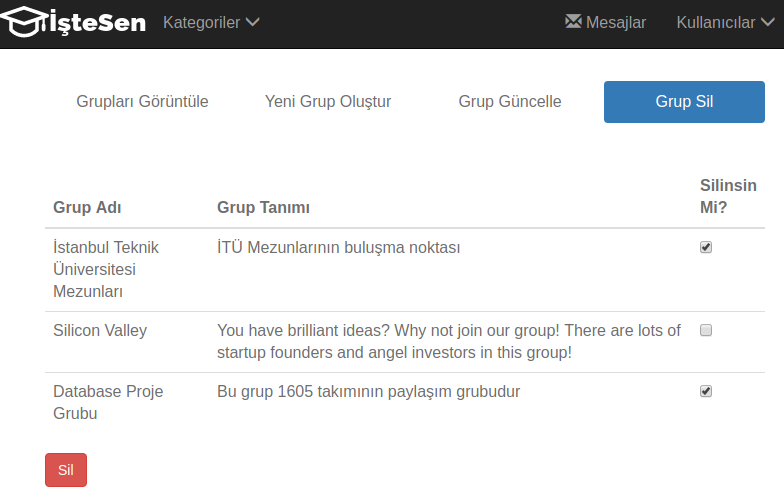

   Grup Silme Sayfası

Grupları silme sayfasında kullanıcıya bütün gruplar tablo şeklinde listelenir ve kullanıcı silmek istediği grupların
yanlarındaki seçme kutularını işaretleyerek *Sil* butonu aracılığıyla istediği grupları silebilmektedir.

MESAJLAR
--------

**Mesajlar ile ilgili sayfalarda aşağıdaki işlemler gerçekleştirilebilmektedir:**
   * **Yeni Mesaj Gönderme**
   * **Gelen Mesajları Görüntüleme**
   * **Gönderilen Mesajları Görüntüleme**

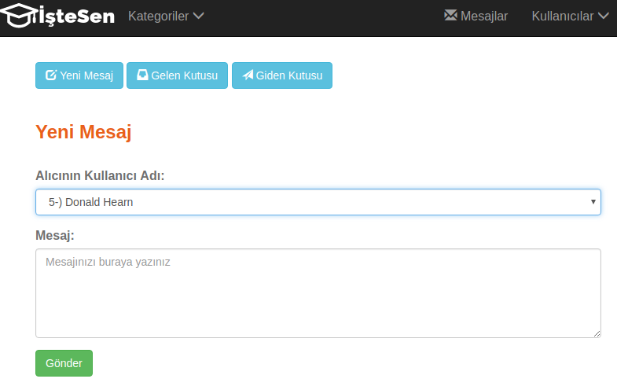

   Yeni Mesaj Sayfası

Yeni mesaj göndermek için kullanıcı dropdown menüden mesaj göndermek istediği kullanıcıyı seçtikten sonra
mesaj kısmına mesajını yazıp *Gönder* butonuna basarak istediği üyeye mesaj gönderebilmektedir.

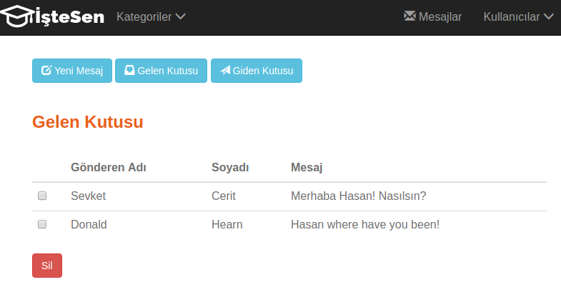

   Gelen Kutusu

Gelen kutusu sayfasında kullanıcıya gelen mesajlar listelenmektedir.

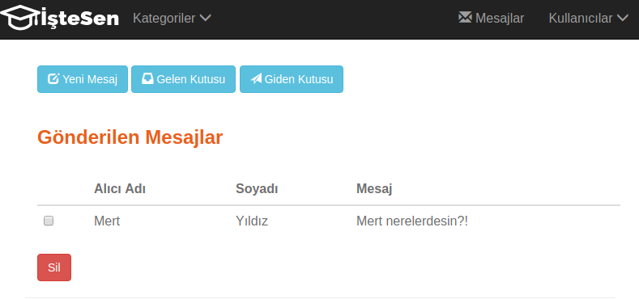

   Giden Kutusu

Gönderilen mesajlar sayfasında kullanıcının gönderdiği mesajlar listelenmektedir.

